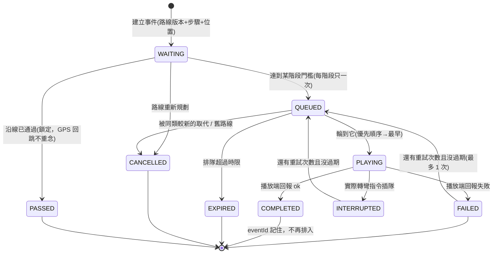
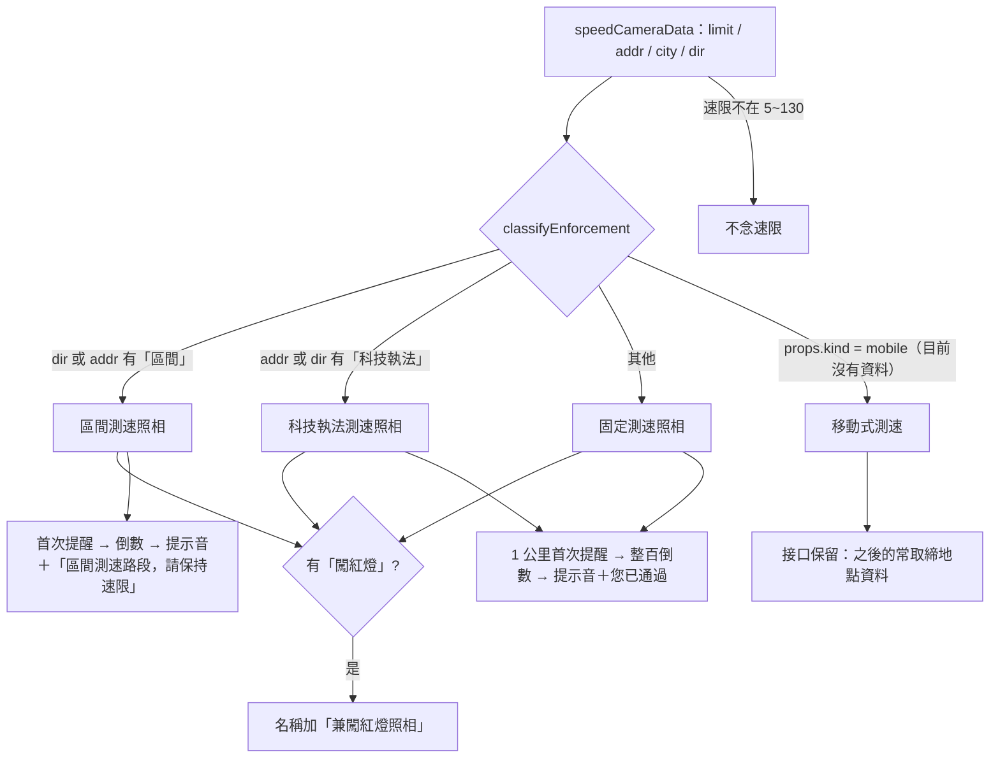

# 智行地圖 播報 3.0 設計文件

只重寫「導航語音播報子系統」。地圖 UI、路線規劃、GPS 定位、道路資料、測速資料都沿用原本的。

| 檔案 | 用途 |
|---|---|
| `nav-voice.js`（新增） | 播報核心：速度驗證、轉彎事件、執法分類、統一語音佇列、提示音。不碰 DOM，可在 node 跑單元測試 |
| `智行地圖.html` | 把舊的播報入口接到新核心（測速照相、轉彎、開始導航、重新規劃、到達、路況、音訊解鎖、速度驗證） |
| `tts/nav-tts.js` | 系統語音回報「真的念完 / 失敗 / 沒開始」 |
| `tests/nav-voice.test.js`（新增） | 核心單元測試（模擬） |
| `tests/speed-camera-alert-state.test.js` | 原本 23 項測速測試保留，加上 3.0 的整合測試 |
| `tests/nav-trip-info.test.js` | 改用新的播報介面 |

主控台除錯：`NavVoiceLog()` 看最近 40 段播報的狀態（排隊、播放中、播完、失敗、過期、取消、被打斷）與原因；`window._voiceDebug = true` 每段都印出來。

---

## 一、研究：主流導航 App 的公開資料

標記：🟢 官方文件已確認　🔵 業界常見設計　🟡 智行地圖自行設計　⚪ 待驗證

| 參考產品 | 已查證的公開功能 | 可借鑑的設計 | 無法確認的部分 |
|---|---|---|---|
| Google Maps（[說明](https://support.google.com/maps/answer/3273406?hl=en)、[官方介紹](https://blog.google/products-and-platforms/products/maps/ask-maps-immersive-navigation/)） | 🟢 聲音有「靜音 / 只播警示 / 取消靜音」三種，「只播警示」時不念逐步轉彎；導引音量分小、中、大；可在通話中繼續播語音；車道指引不是所有國家/語言都有。🟢 官方介紹提到語音更自然，例如快到時說「略過這個出口、走下一個」 | 🔵 語音短而自然；車道資訊只在可靠時才念；「警示」跟「轉彎指引」分開 | 提醒距離、觸發演算法都沒公開 |
| Apple 地圖（[說明](https://support.apple.com/zh-tw/guide/iphone/iphd3c85c193/ios)） | 🟢 可調語音導航音量；「語音導航時暫停語音音訊」(Podcast/有聲書每一步都暫停)；「播放廣播時聆聽導航」；「使用語音導航時喚醒裝置」 | 🔵 播報時壓低/暫停其他音訊（本專案沿用原本的 `_duckRadio` 壓低廣播音量） | 內部播報狀態機與提醒距離沒公開 |
| TomTom Navigation SDK（[逐步導航](https://docs.tomtom.com/navigation/android/guides/navigation/turn-by-turn-navigation)、[語音](https://docs.tomtom.com/navigation/android/guides/navigation/voice-instructions)） | 🟢 每次位置更新產生導引更新，含下一個動作、距離與指令階段 `InstructionPhase`（值沒公開）。🟢 `AnnouncementListener` 是所有可聽見播報（導引與非導引，例如塞車警示）的統一入口；訊息分「要念的文字」與「只有聲音的 Alert」；衝突策略 `PriorityCancellation` 取消較低優先的衝突，Alert 一律送出。🟢 TTS 佇列依優先順序：新訊息優先順序較高就打斷目前的；訊息有時間限制，過期回報 `MessageTimedOutError`；拿不到音訊焦點回報 `AudioFocusError`。🟢 到達半徑：高速公路 100 m、其他 50 m | 🟡 統一事件入口＋優先順序＋過期＋播放結果回報（本專案的 `createVoiceQueue`）；文字播報與提示音分開 | 「可觸發範圍」的實際距離數值沒公開 |
| Sygic Maps SDK（[Android](https://developers.sygic.com/maps-sdk/android/navigation/)、[iOS](https://developers.sygic.com/maps-sdk/ios/navigation/)） | 🟢 語音包分 TTS 與預錄；只有 TTS 會念路名。🟢 iOS 每種聲音各有回呼決定要不要播（指令、速限、事件/測速、平交道、急彎、更好路線、路況）。🟢 區間測速的建議速度隨車速與距離改變 | 🔵 語音內容與播放控制分開；依警示類型決定要不要出聲 | 完整內部規則沒公開；`AudioNotificationParameters(50, 50)` 的意義文件沒說明 |
| Radarbot（[警示說明](https://help.radarbot.com/en/articles/13886047-06_alerts-and-warnings)） | 🟢 固定點（固定測速、隧道測速、常有移動測速區、闖紅燈照相、區間平均速度…）與移動點（移動測速、臨檢…）分開；每種警示可設定語音、聲音、視覺、震動；可設定提醒距離 −20%～+60%；區間測速會顯示區間平均速度 | 🔵 依設備類型區分說法與提醒方式；「常取締地點」是獨立類型 | 判斷演算法沒公開 |

**沒有任何一家公開「幾公尺開始提醒」的數值。** 下面所有距離都是 🟡 智行地圖自行設計的初始測試參數，⚪ 需要實際上路調整。

---

## 二、現有系統盤點（改之前）

### 實際資料欄位對應表（名稱取自原始碼）

| 類別 | 實際欄位 | 資料來源 | 單位 | 必要性 | 驗證方式（3.0） |
|---|---|---|---|---|---|
| GPS | `pos.coords.speed` | `navigator.geolocation.watchPosition`（`enableHighAccuracy`, `maximumAge: 1000`），約每秒一次 | 公尺/秒（×3.6 → 公里/小時） | 必要 | `createSpeedValidator`：缺值/負數/NaN/>250/一秒變化 >30 km/h/過期 5 秒 |
| GPS | `pos.coords.latitude / longitude` | 同上 | 經緯度 | 必要 | 原本就有跳點判斷（`jumped`） |
| GPS | `pos.coords.accuracy` | 同上 | 公尺 | 選用 | 不準時提早念實際指令（最多 +20 m） |
| GPS | `pos.coords.heading` | 同上 | 度 | 選用 | 原本的車頭方向邏輯 |
| 路線 | `navSteps`（OSRM `route.legs[0].steps`） | OSRM / routing.openstreetmap.de / Valhalla（`format=osrm`） | — | 必要 | 每條路線一個 `_navRouteVersion` |
| 路線 | `step.maneuver.type`、`.modifier`、`.location`、`.exit` | 同上 | 文字 / [經, 緯] | 必要 | `isSpokenManeuver`、`actionText` |
| 路線 | `step.distance` | 同上 | 公尺（這個動作到下一個動作） | 必要 | 連續轉彎合併 |
| 路線 | 到下一個動作的距離 `meters` | `navPositionOnRoute` 沿路線計算 | 公尺 | 必要 | — |
| 路線 | 已通過 `passed` | 沿線超過轉彎點 30 m（`NAV_STEP_PASSED_M`） | 布林 | 必要 | 通過後事件鎖定 |
| 道路 | `step.name` | OSRM | 文字 | 視資料 | 有才念「進入XX」 |
| 道路 | 道路類型 | **沒有**直接的欄位 | — | — | 🟡 用路名（國道/高速/快速/交流道）、動作類型、車速推斷 |
| 道路 | 車道 `step.intersections[0].lanes[].valid` | OSRM（不一定有） | — | 視資料 | 建議車道全在一側才念 |
| 道路 | 紅綠燈數量 | **沒有** | — | — | 不念 |
| 執法 | `speedCameraData.features[].properties.limit / addr / city / dir` | 警政署「測速執法設置點」（`tools/update-speedcams.js`），1895 筆 | km/h / 文字 | 必要 | `classifyEnforcement`、`validLimit`（5~130） |
| 執法 | 類型代碼 | **沒有**，只能從 `dir`/`addr` 文字判斷 | — | — | 區間 49、兼闖紅燈 11、科技執法 2（另有雪山隧道等寫在地址） |
| 執法 | 有效方向 | `dir`（例如「北向南」「往南」「南下」「雙向」） | 文字 | 視資料 | 原本的 `parseCamDir` / `camDirOk`（保留） |
| 執法 | 距離 | 沿導航路線或「前方道路」計算（`camContext`） | 公尺 | 必要 | 原本就有（保留） |
| 區間測速 | 起點/終點座標 | **沒有**，每筆只有一個點，地址寫「X至Y」 | — | — | 不假裝知道終點，見下方 |
| 移動式測速 | — | **沒有資料** | — | — | 保留 `kind: 'mobile'` 的接口 |

### 舊系統的播報入口

`speakQueue(items, opts)` 是唯一的播放佇列，所有入口都經過它：測速照相（首次提醒、整百倒數、通過）、轉彎（距離提醒、立即指令）、開始導航摘要、重新規劃、到達、繼續行駛、路況壅塞、測試按鈕。音訊：`VP`（語音包錄音，目前沒放上去 → 一律走 TTS）、`NavTTS`（預設系統語音，Piper 選用）、測速提示音（Web Audio 振盪器）。沒有其他平行的播報模組。

### 找到的問題與根本原因

| # | 問題 | 根本原因 | 狀態 |
|---|---|---|---|
| 1 | 手機上提示音「有觸發但聽不到」 | 提示音用 Web Audio 即時合成。iPhone 鎖螢幕/切 App/來電後 AudioContext 被暫停，只有觸控才能恢復；舊程式只在**第一次**觸控時 resume，之後不再處理。播放時 `resume()` 沒等結果，照樣排程音符並在 520 ms 後回報「播完」→ 看起來有觸發，其實沒聲音。另外 iPhone 的 Web Audio 會被靜音鍵靜音（`<audio>` 媒體播放不會） | ✅ 原因已從程式確認；⚪ iPhone 實機尚未驗證 |
| 2 | 系統語音失敗也當成念完 | `SystemEngine.speak` 的 onend / onerror / 8 秒逾時都只 `resolve()`，分不出念完或失敗；iOS 第一次 `speechSynthesis.speak` 必須在觸控裡，舊程式沒處理 | ✅ 已確認 |
| 3 | 轉彎提醒被吃掉 | 全域「兩次轉彎播報至少隔 8 秒」計時器：很近的下一個轉彎在 8 秒內就不播 | ✅ 已確認 |
| 4 | 「請右轉」太晚 | 立即指令在 15 公尺內才念（時速 50 約 1 秒前） | ✅ 已確認 |
| 5 | 實際指令念路名、預告格式不一 | 「300 公尺後請右轉進入XX」「請右轉進入XX」 | ✅ |
| 6 | 長的測速提醒會擋住轉彎 | 舊佇列只有先來後到，沒有優先順序 | ✅ |
| 7 | 區間測速被當固定點、說「您已通過」 | `speedCamType` 只看 `dir`，地址寫區間測速的認不出；通過時一律「您已通過」 | ✅ |
| 8 | 速度無效時念「當前速度0公里」 | `pos.coords.speed \|\| 0`：沒有速度就變 0，照樣念 | ✅ |
| 9 | 異常速度（例如 150） | 速度直接用 GPS 晶片讀數，沒有任何驗證；出隧道/重新定位時晶片偶爾給跳點。⚪ 真正出現 150 的那次沒有紀錄，無法確定是哪個來源 | 推測 |
| 10 | 「前方 150 公尺」 | 這次更新前另一台電腦已修好（`d6709ff`：首次提醒取最接近的整百、倒數只念整百）。3.0 的距離念法同樣只念整百/整十 | ✅ 已不會出現 |
| 11 | 「50 公尺提醒」 | 目前的程式**沒有** 50 公尺倒數階段；最接近的是「抵達 30 公尺內（或曾靠近 60 公尺內後離開）→ 提示音＋您已通過」。保留原樣，沒有新增也沒有拿掉 | 已確認 |

---

## 三、新系統架構

```mermaid
flowchart TD
    GPS[GPS：coords.speed / 位置 / accuracy]
    ROUTE[導航路線：navSteps / plannedRouteCoordinates]
    ROAD[道路：step.name / lanes / 動作類型]
    ENF[執法：speedCameraData limit/addr/dir]

    SV[速度驗證 createSpeedValidator]
    CTX[道路情境 turnContext]
    TH[動態距離 turnThresholds]
    TURN[轉彎事件 createTurnAnnouncer]
    CLS[執法分類 classifyEnforcement]
    CAM[測速狀態機 handleSpeedCameraApproach（保留）]
    TEXT[語音內容]
    Q[統一語音佇列 createVoiceQueue]
    AUDIO[播放：VP.run → NavTTS / 提示音 createChime]
    LOG[播報紀錄 NavVoiceLog()]

    GPS --> SV
    SV -->|當前速度或 null| TURN
    SV -->|當前速度或 null| CAM
    ROUTE --> TURN
    ROAD --> CTX --> TH --> TURN
    ENF --> CLS --> CAM
    TURN --> TEXT
    CAM --> TEXT
    TEXT --> Q
    Q --> AUDIO
    AUDIO -->|ok / failed + 原因| Q
    Q --> LOG
```

- **測速照相的選擇與倒數規則完全保留**（選哪一支、沿路距離、方向、鎖定、1 公里首次提醒、整百倒數、通過），只換掉：分類、速度無效處理、區間測速通過說法、播報優先順序與事件代號。
- **轉彎播報整個重寫**成事件模型。
- **所有播報經過同一個佇列**（參考 TomTom 的統一播報入口）。

### 事件生命週期



### 語音優先順序

```mermaid
flowchart TD
    NEW[新的播報] --> DUP{同一 eventId 已播完/已在佇列?}
    DUP -- 是 --> SKIP[略過並記錄]
    DUP -- 否 --> KEY[同 key 的舊排隊被取代]
    KEY --> PRI{優先順序}
    PRI -->|0 實際轉彎指令| CUT{正在播的是測速/一般資訊?}
    CUT -- 是 --> INT[打斷它，被打斷的稍後重播一次(倒數距離不重播)]
    CUT -- 否 --> WAIT[等目前這句念完]
    PRI -->|1 轉彎預告 / 2 測速執法 / 3 一般資訊| WAIT
    INT --> PICK
    WAIT --> PICK[選下一句：先丟過期 → 優先順序最高 → 最早排入]
    PICK --> PLAY[播放 → 回報 ok / 失敗原因]
```

| 優先順序 | 內容 | 過期 | 重試 |
|---|---|---|---|
| 0 CRITICAL | 實際轉彎指令「請右轉」 | 4 秒 | 1 次 |
| 1 TURN | 遠距離預告、接近提醒、開始導航摘要、重新規劃、到達 | 6～10 秒 | 1 次 |
| 2 ENFORCE | 測速首次提醒（20 秒）、整百倒數（3 秒，不重試）、通過（6 秒） | 見左 | 見左 |
| 3 INFO | 繼續行駛、路況、測試 | 依呼叫 | 0 |

已經在念的句子不會被一般新事件打斷；只有實際轉彎指令可以打斷測速/一般資訊。提示音失敗不會讓後面的「您已通過」不念（紀錄會寫提示音失敗原因）。

---

## 四、轉彎播報

### 道路情境與提醒距離（🟡 自行設計，⚪ 待上路調整）

| 情境（`turnContext`） | 判斷 | 遠距離預告 | 接近提醒 | 實際指令 |
|---|---|---:|---:|---|
| 市區一般 `urban` | 車速 < 55（無效時看是否在國道/快速道路） | 300 m | 100 m | 20～30 m |
| 市區複雜 `urbanComplex` | 圓環、迴轉、4 線道以上 | 500 m | 200 m | 20～30 m |
| 郊區 `suburban` | 車速 ≥ 55、上匝道 | 500 m | 200 m | 30～50 m |
| 高速公路出口 `exit` | 下匝道；國道/快速道路（或時速 ≥ 70）上的分岔 | 1 km | 500 m | 分流點前約 2 秒（50～120 m） |
| 複雜交流道 `complexInterchange` | 出口後 1 km 內又要分岔/下匝道/匯入 | 2 km | 1 km、500 m | 同上 |

- 實際距離 = 上表與「車速 × 反應時間」（預告 25 秒、接近 9 秒）取大，上限為上表的 2 倍；**算距離時車速最多用 130**，異常讀數不會算出好幾公里外的提醒；車速無效用情境預設（市區 40、郊區 60、交流道 90）。
- GPS 精度差於 15 m 時，實際指令提早最多 20 m。
- 預告離接近提醒不到 5 秒就不念預告；接近提醒離實際指令不到 3 秒就直接等實際指令（避免兩句連發）。
- 一進入這段路就已經比某階段近（短路段）：只念「目前距離所在」的那一階，較遠的階段標記為念過。

### 說法

| 階段 | 範例 |
|---|---|
| 遠距離預告 / 接近提醒 | 「前方300公尺，請右轉進入中山路。」「前方1公里，請靠右下交流道，五股交流道。」 |
| 實際指令 | 「請右轉。」「請靠左行駛。」（**不加「前方」、不念距離**；前面都沒念過才加路名） |
| 連續轉彎（下一個動作在 100～250 m 內，依車速） | 「請右轉，接著左轉。」「前方200公尺，請右轉，接著左轉。」— 下一個轉彎的預告不再念，但到了路口**仍念「請左轉」** |
| 到達 | 接近時「前方100公尺到達目的地。」，到達時「已到達目的地。」 |
| 車道 | OSRM 車道資料完整、建議車道全在一側才加「請走左側車道」 |
| 紅綠燈數量 | 沒有可靠資料，不念 |

距離念法：1 公里以上以 0.5 公里為單位、100 公尺以上念整百、更近念整十，不會念 150、437 這種數字。

### 轉彎播報流程

```mermaid
flowchart TD
    START[GPS 更新：下一個動作、沿線距離] --> VALID{這個動作要念? 事件還在等待?}
    VALID -- 否 --> END[不念]
    VALID -- 是 --> PASS{沿線已通過?}
    PASS -- 是 --> LOCK[鎖定 PASSED：GPS 回跳不重念、開過頭不補念]
    PASS -- 否 --> CTX[道路情境 + 車速 → 各階段距離]
    CTX --> NOW{≤ 實際指令距離?}
    NOW -- 是且沒念過 --> NV[「請右轉」(+接著…)]
    NOW -- 否 --> NEAR{≤ 接近提醒距離?}
    NEAR -- 是且沒念過 --> NR[「前方X，請右轉進入Y」(+車道、接著…)]
    NEAR -- 否 --> FAR{≤ 遠距離預告?}
    FAR -- 是且沒念過 --> FR[「前方X，請右轉進入Y」]
    FAR -- 否 --> END
```

### 防重複

- 事件代號 = 路線版本 + 步驟索引 + 轉彎點座標；每個階段一個旗標，念過不再念（距離 220→195→205→185 只念一次）。
- 通過（沿線超過 30 m）後事件鎖定。
- 重新規劃 → 路線版本 +1，舊事件刪除、佇列中舊路線的提醒取消。
- 不使用全域計時器擋所有播報；同一事件播完後佇列也會拒絕再排入。

---

## 五、測速與交通執法



| 類型 | 處理 |
|---|---|
| 固定式 | 完全沿用原本規則：「1公里後有固定測速照相，限速60公里。」→「當前速度50公里」→（超速）「您已超速」→「900公尺」…「100公尺」→ 提示音 →「您已通過」 |
| 區間測速 | 名稱「區間測速照相」（地址欄寫區間的也認得出來）。資料每筆只有一個點、沒有終點座標，**不假裝知道終點、沒有平均速度計算**，所以通過該點時不說「您已通過」，改說「區間測速路段，請保持速限」 |
| 兼闖紅燈 | 資料裡的闖紅燈都是「兼闖紅燈 / 超速闖紅燈」，仍是測速設備，所以照樣念速限與當前速度，名稱加「兼闖紅燈照相」 |
| 科技執法 | 例如雪山隧道科技執法，有速限，名稱「科技執法測速照相」 |
| 移動式 | 專案沒有資料。`classifyEnforcement` 已支援 `kind: 'mobile'`；常取締地點資料整理好後，加進 `speedCameraData`（同樣的 limit/addr/dir 欄位＋`kind: 'mobile'`）就會走同一套鎖定、方向、倒數 |
| 有效方向 | 沿用原本的 `parseCamDir` / `camDirOk`：方向資料跟道路同向但相反 → 對向不播；方向資料跟道路根本不同向（資料錯）→ 照播；沒有方向（雙向）→ 照播 |
| 速度無效 | 不念「當前速度」、不判斷超速（不念虛構的數字） |

---

## 六、手機提示音

- 提示音改成預先合成的 WAV，用 `<audio>` 播：媒體播放不受 iPhone 靜音鍵影響，回到前景不需要 AudioContext。
- 每次觸控都檢查並解鎖：AudioContext 沒在跑就 resume＋播一段無聲音訊；`<audio>` 靜音播一次解鎖；系統語音在第一次觸控時念一句無聲的句子。
- 播放結果分五種記錄：排入（queued）→ 開始播放（`playing` 事件 / 系統語音 `onstart`）→ 播完（`ended` / `onend`）→ 失敗（`play()` 被拒、`error`、2 秒內沒開始、AudioContext 沒恢復）→ 有限重試 1 次。
- `<audio>` 不能播才退回 Web Audio，退回前確認 AudioContext 真的在跑，沒有就回報失敗原因（「AudioContext suspended(需要觸控螢幕恢復)」）。

---

## 七、測試紀錄

全部是**模擬測試**（node 單元測試＋電腦瀏覽器）。**尚未在 iPhone / Android 實機驗證**。

### 單元測試（`node --test tests/*.test.js`）：93 項全過

| 情境 | 預期 | 結果 |
|---|---|---|
| 市區一般路口 300→100→實際指令 | 3 階段各一次，實際指令「請右轉。」 | 通過 |
| 實際指令距離 | 市區 20～30 m、郊區 30～50 m | 通過 |
| GPS 220/195/205/185 來回 | 不重複階段 | 通過 |
| 通過後 GPS 回跳 | 不重念 | 通過 |
| 開過頭 | 不補念 | 通過 |
| 高速公路出口 | 1 km、500 m、實際指令 | 通過 |
| 複雜交流道 | 2 km、1 km、500 m、實際指令 | 通過 |
| 靠左/靠右 | 「請靠左行駛。」「請靠右行駛。」 | 通過 |
| 連續轉彎 | 「請右轉，接著左轉。」下一路口仍「請左轉。」 | 通過 |
| 路名缺失 | 不念「進入」，不念紅綠燈 | 通過 |
| 車速無效/異常 | 預設距離、上限 | 通過 |
| 重新規劃 | 舊事件作廢 | 通過 |
| 開始導航第一句 | 念實際距離，較遠階段不再念 | 通過 |
| 改路名直走、道路微彎 | 不念 | 通過 |
| 到達 | 只預告一次 | 通過 |
| 距離念法 | 沒有 150、437 | 通過 |
| 執法分類 | 固定/區間(含地址欄)/兼闖紅燈/科技執法/移動式/無效速限 | 通過 |
| 速度驗證 | 正常、50→150 跳點不採用、真加速接受、缺值用位移、負數/NaN/>250 無效、5 秒過期 | 通過 |
| 佇列 | 優先順序、實際指令插隊與重播、轉彎不互相打斷、過期、eventId 不重播、失敗只重試 1 次、取消舊路線、提示音失敗仍念語音 | 通過 |
| 原本 23 項測速測試 | 1 公里→整百倒數→提示音＋您已通過、超速只在首次提醒、GPS 回跳、跳點、兩支照相機不交錯、平行道路、對向… | 全部照舊通過 |
| 測速 3.0 | 速度無效不念速度、區間測速通過說法、地址欄區間/科技執法/兼闖紅燈、優先順序與事件代號、倒數不重播 | 通過 |

### 瀏覽器整合測試（電腦、模擬 GPS 每 11 公尺一點、時速 40）

| 情境 | 結果 |
|---|---|
| 台北車站 → 台北 101，6 公里、16 步、3 支測速照相 | 轉彎全部「預告 → 接近 → 請X轉」，實際指令沒有「前方」；每支照相機倒數 900…100 各一次，提示音＋您已通過；轉彎提醒優先穿插；到達只預告一次；沒有 150 |
| 第一次跑發現：倒數「500公尺」被「請右轉」打斷後重播舊距離 | 已修正：倒數距離不重試 |
| 第一次跑發現：到達念三次 | 已修正：只在接近時預告 |
| 道路微彎被念成「請靠右」 | 已修正：跟原本一致不念 |
| 速度 50 → 150 → 52 | 150 不採用（記錄「疑似跳點」），畫面與播報都用 50、再 52 |
| 提示音：`<audio>` 被拒＋AudioContext 暫停（用程式模擬） | 回報失敗原因「NotAllowedError；Web Audio：AudioContext suspended」，重試 1 次後停止，不會無限重試 |
| 電腦瀏覽器正常播放提示音 | `{ ok: true, stage: 'completed' }` |

### 尚未完成

- ⚪ iPhone Safari / 加到主畫面（PWA）實機：靜音鍵開啟、鎖螢幕後回來、播音樂時、藍牙/CarPlay。
- ⚪ Android Chrome 實機。
- ⚪ 實際上路調整提醒距離（市區、郊區、國道出口、複雜交流道）。
- ⚪ 「150」異常速度：已加驗證與紀錄（`_speedValidator.lastRejected()`），下次出現時可以看到被擋下的讀數與原因。
